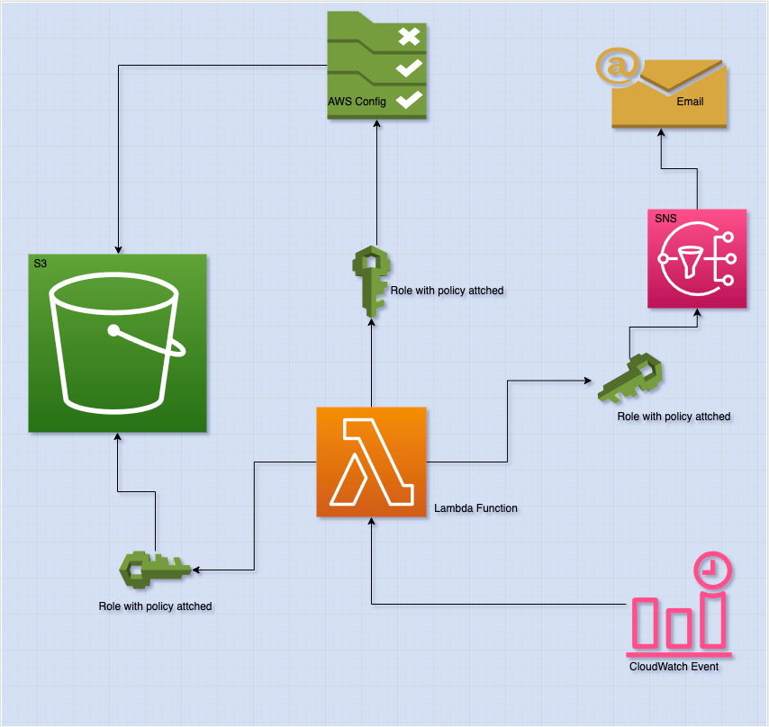

# S3 bucket public access remediation

## Project Description
Your Senior Management is concern about engineers creating public accessible S3 buckets.
They want you to track situations like this and if you find any, they want you to remediate them.
After the remediation is complete, they want you to send a notification to the security department about which buckets 
were remediated.

### Your solution should:
Detect any public accessible S3 Buckets (Hint: Use AWS Config)

Remediate the bucket(s) and make private.

Send an SNS notification of which bucket(s) were remediated.(use Eventbridge)

Note: AWS Config is not a free service. Be sure to delete your solutions after completion.

## Solution
- Using AWS Config, Lambda, SNS and EventBridge (IMPLEMENTED)
  1. Create rule aws config
  2. Have lambda function that get result from config, remediate non-compliant bucket and send notification via sns
     

## How to set up AWS Resource
### Create AWS Config rule to check for s3 bucket that are publicly accessible
- Create Config Rules
  - go to aws console
  - search config and click on Config
  - click rules
  - click add rule
  - select rule type : Add AWS managed rule
  - AWS Managed Rules : Search S3 (Select the rule that check if s3 public access is enable)
    - Selected : s3-bucket-level-public-access-prohibited
  - Click Next
  - Click Next
  - Click Add rule

### Create SNS topic
- From aws console
  - search sns function and click on Simple Notification Service
  - Click Next Step / Create Topic
  - Type: Standard
  - Name : <Some name for topic>
  - Click Create topic
  - After creating topic, we need to create subscription
    - Click Create Subscription
    - Topic ARN : By default the topic you just created but can change it if you want
    - Protocol : Email
    - Endpoint : an active email address
    - click Create subscription
  - Go to you email and check for email from aws
  - Click Confirm Subscription

### Create Lambda Function
- From aws console
- Search lambda function and click on Lambda
- Select Create Function
- Select Author from scratch
- Function Name: Give a descriptive name
- Runtime: Python 3.6
- Architecture: x86_64
- Leave Execution role to `Create a new role with basic Lambda permissions`
- Click Create Function
- Now that Lambda function is created let add a trigger
  - Select Add trigger
  - Search and select EventBridge (Cloudwatch Events)
  - Rule : Create a new rule
  - Rule Type : Schedule
  - Schedule expression : rate(30 minutes) / cron(*/30 * * * *)
    - To use cron see [crontab](https://crontab-generator.org/) for guidance
- Select Configuration
- Select Permission
- Click on Role Name (this opens up new tab and show iam roles )
  - click on attach policy
  - click on create policy
    - Policy for Config
      - Service : config
      - Action : Expand Read :  Select GetComplianceDetailsByConfigRule
      - Resources : Go and copy Config Rule arn and add it here
  - Click Add Additional Permission
    - Policy for SNS
      - Service : SNS
      - Action : Expand Write :  Select Publish
      - Resources : Go and copy Topic ARN and add it here
  - Click Add Additional Permission
    - Policy for S3
      - Service : S3
      - Action : Expand Permissions Management :  Select PutBucketPublicAccessBlock
      - Resources : Select All resources (We want to be able to remediate all s3 bucket)
    - click Next: Tags
    - click Next: Review
    - Name : Give name to policy
    - Click Create Policy
- Go back to roles (might refresh if you switch tab)
- Search for new policy you just created and check it (select it)
- Click attach policy
- From aws console
- search lambda function and click on Lambda
- Select our new lambda function
- Copy your code into the function and Deploy
- If Environment Variable is needed
  - Click configuration
  - Environment Variable
  - Click edit
  - click add environment variable
- To add Trigger (CloudWatch Event/ EventBridge)
  - Click on add trigger
  - Search and Select EventBridge
  - Select : Create a new rule
    - Rule name: TriggerLambdaFunctionEvery30Minute
    - Rule description: This rule trigger lambda function every 30 minutes
    - Rule Type : Select Schedule Expression
    - Schedule expression* : rate(30 minutes)
  - Click Add

## Working with Lambda Function:
The following environment variables are need :
- RULE_NAME : Name of rules where you want us to check result
- TOPIC_ARN : SNS topic that you subscribed to, and you want us to send message to

## Improvement Idea
- Deploy resources using Terraform/Cloudformation
- Trigger Lambda function using event 
  - Can try to use cloud trial config log when it non-compliant